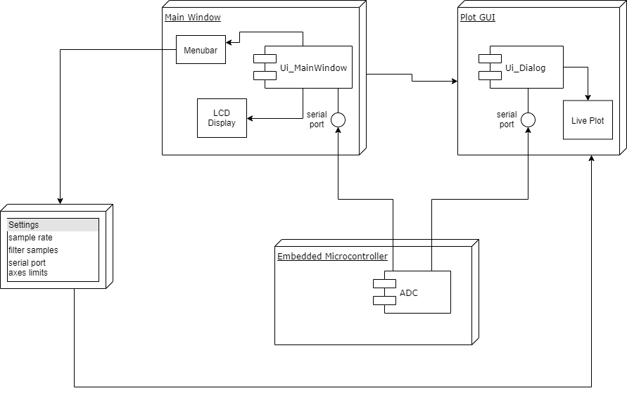

Introduction
============

This package is a Qt-based GUI for the UVML's Oxford ICP/RIE tool. Its primary purpose is to allow the user to plot the interferometric laser endpoint signal from the tool in real time, independent from the Oxford software. The main loop requests a value from an ADC over a serial connection and plots it in an embedded matplotlib animation. The user may also tweak settings such as sample rate, axes limits, averaging, etc.

A high-level diagram showing how the program works is given below:

